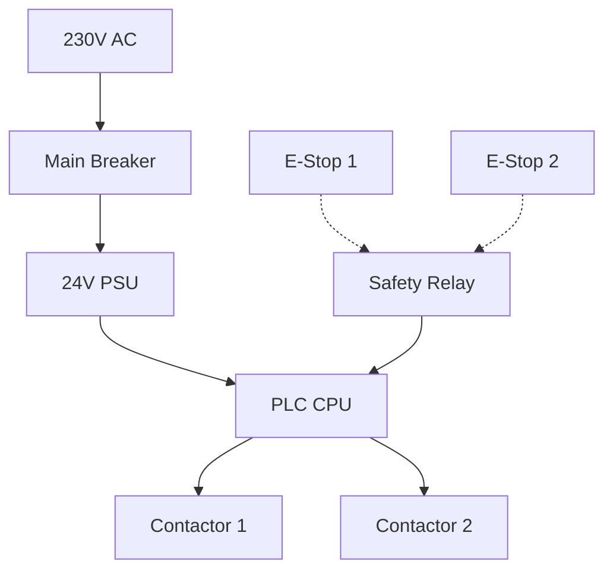

# LangGraph Flow Documentation

This document describes the LangGraph multi-agent workflow used in Volta for electrical engineering analysis.

## Overview

Volta uses LangGraph to orchestrate a 12-node DAG (Directed Acyclic Graph) that processes natural language requirements and generates engineering deliverables.

## Graph Topology

```
              START
                │
                ▼
        requirements_agent
        ┌───────┼───────┐
        ▼       ▼       ▼
category_mapper  safety_assessor  constraint_extractor
        └───────┼───────┘
                ▼
        selection_supervisor
        (Hybrid RAG + Memory Injection)
                │
                ▼
          rule_validator
        (5 Hard Constraints)
   ┌────┬────┬────┬────┬────┐
   ▼    ▼    ▼    ▼    ▼    ▼
schematic_  code_  wiring_  commissioning_  final_review
generator   gen    generator generator       _agent
   └────┴────┴────┴────┴────┘
                ▼
               END
```

## State Definition

The `AnalysisState` TypedDict flows through all nodes:

```python
class AnalysisState(TypedDict):
    # Conversation history
    messages: Annotated[list, add_messages]
    
    # Requirements analysis
    requirements: dict
    title: str
    topic_tags: list[str]
    
    # Parallel analysis outputs
    categories: dict
    safety_assessment: dict
    constraints: dict
    
    # Component selection
    bom_items: list[dict]
    selection_sources: list[dict]
    
    # Validated BOM
    validated_bom: list[dict]
    validation_results: list[dict]
    
    # Deliverables
    mermaid_code: str
    st_code: str
    wiring_rows: list[dict]
    commissioning_steps: list[dict]
    
    # Final output
    final_report: dict
    
    # Error tracking
    errors: list[str]
```

## Node Descriptions

### 1. requirements_agent

**Purpose:** Extract structured requirements from natural language.

**Input:**
- `messages`: User's natural language requirement

**Output:**
- `requirements`: Structured requirement dict
  - `machine_type`: Type of machine/system
  - `safety_level`: SIL level (0-3)
  - `environment`: Environmental conditions
  - `plc_family`: Preferred PLC family
  - `io_requirements`: Approximate IO counts
  - `communication_protocol`: PROFINET/PROFIBUS/EtherCAT

**LLM Prompt:**
```
You are an expert electrical engineer specializing in industrial automation.
Extract structured requirements from the user's description.
```

**Example:**
```
Input: "Design a conveyor with 3 motors, SIL 1, S7-1200, PROFINET"
Output: {
  "machine_type": "conveyor",
  "safety_level": "SIL 1",
  "plc_family": "Siemens S7-1200",
  "communication_protocol": "PROFINET",
  "motor_count": 3
}
```

### 2. category_mapper

**Purpose:** Categorize the system into functional units.

**Input:**
- `requirements`: Structured requirements

**Output:**
- `categories`: Dict of functional categories
  - `power_distribution`: Components for power
  - `control_system`: PLC, HMI, etc.
  - `motor_control`: VFDs, starters
  - `safety_system`: E-stops, relays
  - `sensing`: Sensors, switches

**LLM Prompt:**
```
Categorize the system into functional units based on requirements.
```

### 3. safety_assessor

**Purpose:** Assess safety requirements and identify needed safety components.

**Input:**
- `requirements`: Structured requirements

**Output:**
- `safety_assessment`: Safety analysis
  - `required_sil_level`: Target SIL level
  - `safety_functions`: Required safety functions
  - `redundancy_requirements`: Redundancy needs
  - `safety_components`: Required safety components

**LLM Prompt:**
```
Assess safety requirements based on SIL level and application.
Identify required safety functions and components.
```

### 4. constraint_extractor

**Purpose:** Extract design constraints (voltage, protocol, environmental).

**Input:**
- `requirements`: Structured requirements

**Output:**
- `constraints`: Design constraints
  - `voltage_levels`: Control and power voltages
  - `protocol_requirements`: Communication protocols
  - `environmental_constraints`: Temperature, humidity, IP rating
  - `space_constraints**: Cabinet size limitations

**LLM Prompt:**
```
Extract all design constraints from requirements.
```

### 5. selection_supervisor

**Purpose:** Select components using hybrid RAG + memory injection.

**Input:**
- `categories`: Functional categories
- `safety_assessment`: Safety requirements
- `constraints`: Design constraints
- `episodic_memories`: Historical decisions (from M3)
- `selection_weights`: Organization bias (from M2)

**Output:**
- `bom_items`: List of selected components
- `selection_sources`: Source tracing for each item

**Hybrid RAG Process:**

1. **Vector Search (Qdrant):**
   - Query: Component category + requirements
   - Filter by manufacturer, voltage, protocol
   - Return top-k similar chunks

2. **Graph Traversal (PostgreSQL):**
   - Start from seed components
   - BFS traversal to depth 3
   - Filter by relation types (COMPATIBLE_WITH, REQUIRES_POWER)
   - Return neighbor components

3. **Memory Injection:**
   - Retrieve relevant episodic memories
   - Apply selection_weights bias
   - Rank candidates by combined score

**Scoring Formula:**
```
score = 0.4 * vector_similarity + 0.3 * graph_relevance + 0.2 * weight_bias + 0.1 * memory_match
```

**Example Output:**
```json
{
  "bom_items": [
    {
      "name": "PLC CPU",
      "manufacturer": "Siemens",
      "model": "6ES7 1214C-1/...",
      "category": "control_system",
      "confidence": 0.92,
      "source": "rag"
    }
  ],
  "selection_sources": [
    {
      "item_id": "item_1",
      "sources": [
        {"type": "rag_chunk", "chunk_id": "chunk_123", "score": 0.95},
        {"type": "graph_neighbor", "node_id": "node_456", "score": 0.88}
      ]
    }
  ]
}
```

### 6. rule_validator

**Purpose:** Validate BOM against 5 hard constraints.

**Input:**
- `bom_items`: Selected components
- `requirements`: Original requirements
- `constraints`: Design constraints

**Output:**
- `validated_bom`: Filtered/corrected BOM
- `validation_results`: Validation results per rule

**5 Hard Constraints:**

1. **Breaker Rating Rule:**
   ```python
   def check_breaker_rating(load_current, breaker_rating):
       return breaker_rating >= load_current * 1.25
   ```

2. **SIL Redundancy Rule:**
   ```python
   def check_sil_redundancy(sil_level, safety_relay_count):
       if sil_level >= 2:
           return safety_relay_count >= 2
       return True
   ```

3. **Protocol Compatibility Rule:**
   ```python
   def check_protocol_compatibility(components):
       protocols = {c.protocol for c in components if c.protocol}
       return len(protocols) <= 1  # All devices use same protocol
   ```

4. **Voltage Matching Rule:**
   ```python
   def check_voltage_matching(coil_voltage, control_voltage):
       return coil_voltage == control_voltage
   ```

5. **Motor Starter Match Rule:**
   ```python
   def check_motor_starter_match(motor_kw, contactor_rating, thermal_rating):
       return motor_kw <= contactor_rating and motor_kw <= thermal_rating
   ```

**Validation Output:**
```json
{
  "validated_bom": [...],
  "validation_results": [
    {
      "rule": "breaker_rating",
      "passed": true,
      "message": "All breakers adequately rated"
    },
    {
      "rule": "protocol_compatibility",
      "passed": false,
      "message": "Mixed PROFINET and PROFIBUS detected",
      "correction": "Standardized to PROFINET"
    }
  ]
}
```

### 7. schematic_generator

**Purpose:** Generate Mermaid electrical schematic.

**Input:**
- `validated_bom`: Validated component list
- `requirements`: System requirements

**Output:**
- `mermaid_code`: Mermaid diagram code

**Generation Process:**

1. Analyze power flow from validated_bom
2. Identify main power distribution
3. Map control circuits
4. Add safety circuits
5. Generate Mermaid syntax

**Example Output:**


### 8. code_generator

**Purpose:** Generate PLC Structured Text code.

**Input:**
- `validated_bom`: Validated component list
- `requirements`: System requirements
- `constraints`: Design constraints

**Output:**
- `st_code`: ST code with multiple modules

**Generated Modules:**

1. **MAIN_OB**: Main organization block
2. **FC_MotorControl**: Motor control function
3. **FC_Safety**: Safety monitoring function
4. **FB_Drive**: Drive function block
5. **DB_Parameters**: Parameter data block

**Example Code:**
```st
ORGANIZATION_BLOCK MAIN
VAR
    Safety_OK : BOOL;
    Start_Command : BOOL;
    Motor1_Run : BOOL;
END_VAR
BEGIN
    // Safety monitoring
    Safety_OK := NOT E_Stop_1 AND NOT E_Stop_2;
    
    IF NOT Safety_OK THEN
        Motor1_Run := FALSE;
    END_IF;
    
    // Motor control
    Motor1_Output := Motor1_Run AND Safety_OK;
END_ORGANIZATION_BLOCK
```

### 9. wiring_generator

**Purpose:** Generate wiring table.

**Input:**
- `validated_bom`: Validated component list
- `mermaid_code`: Schematic for connection reference

**Output:**
- `wiring_rows`: List of wiring connections

**Wiring Row Structure:**
```json
{
  "tag": "X1.1",
  "signal": "24V+",
  "from": "PSU +24V",
  "to": "PLC X1",
  "wire": "1.5mm² RED"
}
```

**Generation Logic:**

1. Extract connections from schematic
2. Assign terminal tags
3. Determine wire gauge based on current
4. Assign wire color per IEC standards

### 10. commissioning_generator

**Purpose:** Generate commissioning guide.

**Input:**
- `validated_bom`: Component list
- `requirements`: System requirements
- `st_code`: Generated code

**Output:**
- `commissioning_steps`: List of commissioning steps

**Commissioning Sections:**

1. **Pre-commissioning Checklist**
   - Verify wiring
   - Check power supply
   - Test sensors

2. **Power-Up Procedure**
   - Apply control power
   - Apply main power
   - Verify indicators

3. **I/O Testing**
   - Test digital inputs
   - Test digital outputs
   - Verify feedback

4. **Functional Testing**
   - Test individual functions
   - Test interlocks
   - Test emergency stop

5. **Performance Testing**
   - Measure response times
   - Verify throughput
   - Check accuracy

### 11. final_review

**Purpose:** Generate final summary and recommendations.

**Input:**
- All previous outputs

**Output:**
- `final_report`: Comprehensive report

**Report Sections:**

1. **Executive Summary**
2. **System Overview**
3. **BOM Summary**
4. **Safety Assessment**
5. **Compliance Check**
6. **Recommendations**
7. **Next Steps**

## Checkpointing

Volta uses `AsyncPostgresSaver` for state persistence:

```python
from langgraph.checkpoint.postgres.aio import AsyncPostgresSaver

checkpointer = AsyncPostgresSaver.from_conn_string(DATABASE_URL)
workflow = builder.compile(checkpointer=checkpointer)
```

**Benefits:**
- Resume after failures
- Inspect intermediate states
- Debug workflow execution
- Support long-running analyses

**Checkpoint Storage:**
- Thread ID = Project ID
- Checkpoint after each node
- State includes all `AnalysisState` fields
- Metadata includes execution time

## Error Handling

Each node includes error handling:

```python
async def my_agent(state: AnalysisState) -> AnalysisState:
    try:
        result = await process(state)
        return {**state, "result": result}
    except Exception as e:
        error_msg = f"Error in my_agent: {str(e)}"
        return {
            **state,
            "errors": state.get("errors", []) + [error_msg]
        }
```

**Error Propagation:**
- Errors are accumulated in `state["errors"]`
- Workflow continues despite non-critical errors
- Critical errors stop the workflow
- Final review includes error summary

## Parallel Execution

LangGraph supports parallel fan-out:

```python
workflow.add_node("category_mapper", category_mapper)
workflow.add_node("safety_assessor", safety_assessor)
workflow.add_node("constraint_extractor", constraint_extractor)

# Fan-out from requirements_agent
workflow.add_edge("requirements_agent", "category_mapper")
workflow.add_edge("requirements_agent", "safety_assessor")
workflow.add_edge("requirements_agent", "constraint_extractor")

# Fan-in to selection_supervisor
workflow.add_edge("category_mapper", "selection_supervisor")
workflow.add_edge("safety_assessor", "selection_supervisor")
workflow.add_edge("constraint_extractor", "selection_supervisor")
```

**State Merging:**
Parallel branches use `Annotated` reducers to merge state:

```python
class AnalysisState(TypedDict):
    messages: Annotated[list, add_messages]  # Appends messages
    errors: Annotated[list, operator.add]    # Concatenates errors
```

## Performance Optimization

### Streaming

Stream intermediate results via WebSocket:

```python
async for event in workflow.astream(initial_state, config):
    if "node" in event:
        await websocket.send_json({
            "stage": event["node"],
            "progress": calculate_progress(event)
        })
```

### Caching

Cache LLM responses for repeated queries:

```python
from langchain.cache import InMemoryCache
from langchain.globals import set_llm_cache

set_llm_cache(InMemoryCache())
```

### Batch Processing

Process multiple BOM items in parallel:

```python
async def validate_batch(bom_items):
    tasks = [validate_item(item) for item in bom_items]
    return await asyncio.gather(*tasks)
```

## Monitoring

### Execution Metrics

Track per-node execution time:

```python
import time

async def timed_agent(state: AnalysisState) -> AnalysisState:
    start = time.time()
    result = await process(state)
    duration = time.time() - start
    
    # Log to run_history
    await log_execution("agent_name", duration)
    
    return result
```

### State Inspection

Inspect state at any checkpoint:

```python
config = {"configurable": {"thread_id": project_id}}
state = await checkpointer.aget(config)
```

## Testing

### Unit Tests

Test individual agents:

```python
@pytest.mark.asyncio
async def test_requirements_agent():
    state = {
        "messages": [{"role": "user", "content": "Design a conveyor"}],
        "requirements": {},
        "errors": []
    }
    
    result = await requirements_agent(state)
    
    assert "requirements" in result
    assert result["requirements"]["machine_type"] == "conveyor"
```

### Integration Tests

Test full workflow:

```python
@pytest.mark.asyncio
async def test_full_workflow():
    initial_state = {
        "messages": [{"role": "user", "content": "Simple motor control"}],
        "requirements": {},
        "bom_items": [],
        "errors": []
    }
    
    result = await workflow.ainvoke(initial_state)
    
    assert len(result["bom_items"]) > 0
    assert len(result["errors"]) == 0
    assert result["mermaid_code"]
```

## Future Enhancements

### Planned Improvements

1. **Dynamic Graph:** Add/remove nodes based on requirements
2. **Human-in-the-Loop:** Pause for user approval at key points
3. **Multi-turn Clarification:** Interactive requirement refinement
4. **Cost Optimization:** Select components based on cost constraints
5. **Alternative Generation:** Generate multiple design alternatives

### M4 Memory Enhancements

- Function pattern extraction
- Validation lesson learning
- Episode embedding for semantic search

## References

- [LangGraph Documentation](https://langchain-ai.github.io/langgraph/)
- [PROJECT_OVERVIEW.md](PROJECT_OVERVIEW.md)
- [DEVELOPER_GUIDE.md](DEVELOPER_GUIDE.md)
